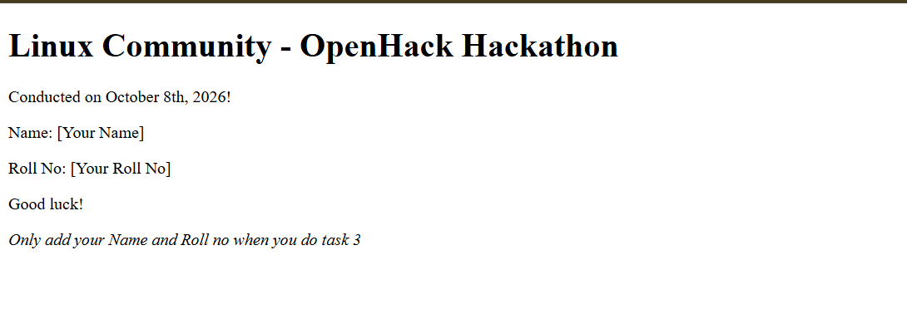
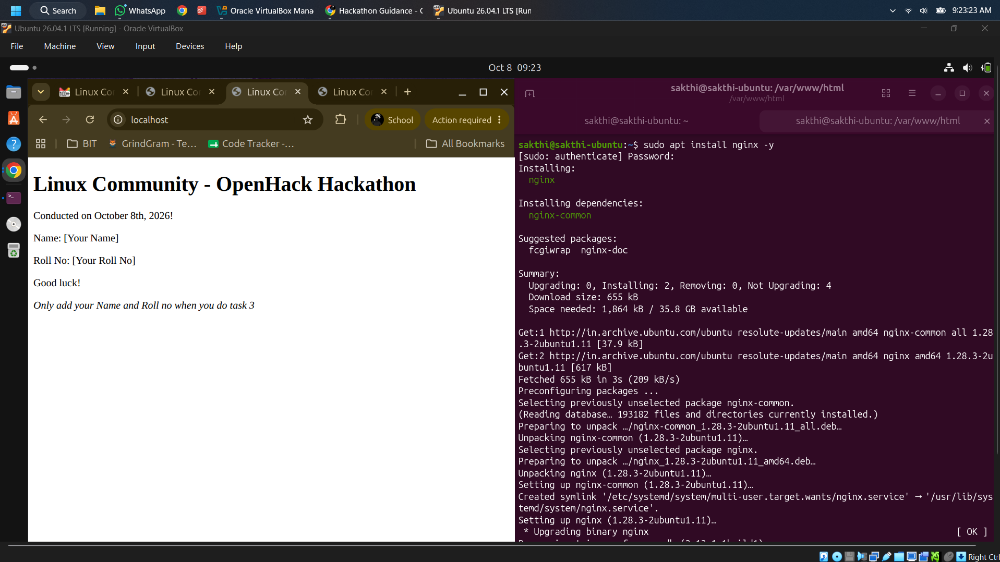
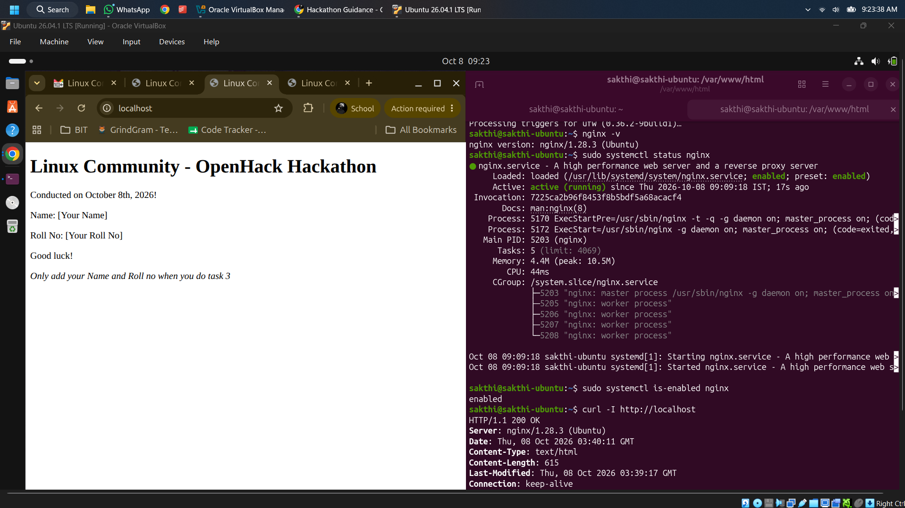
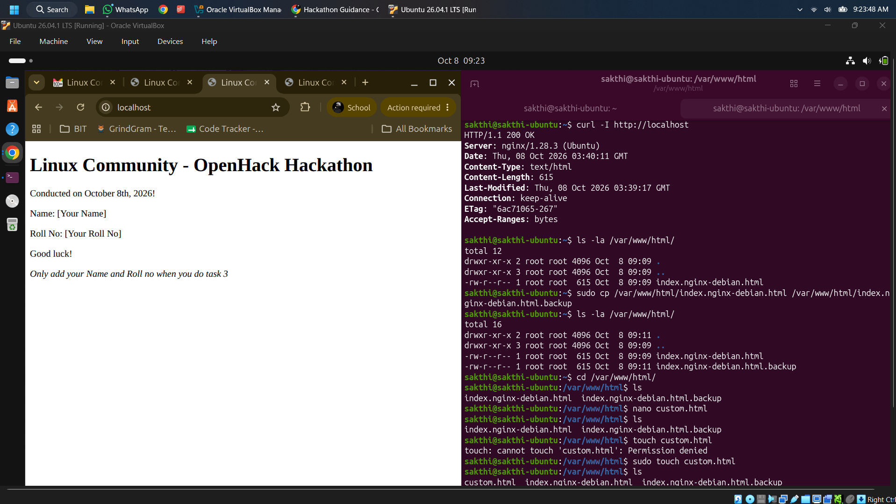
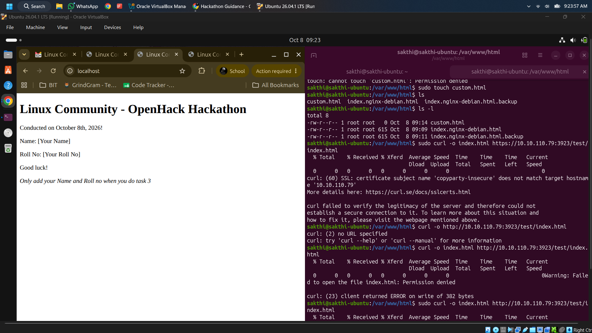
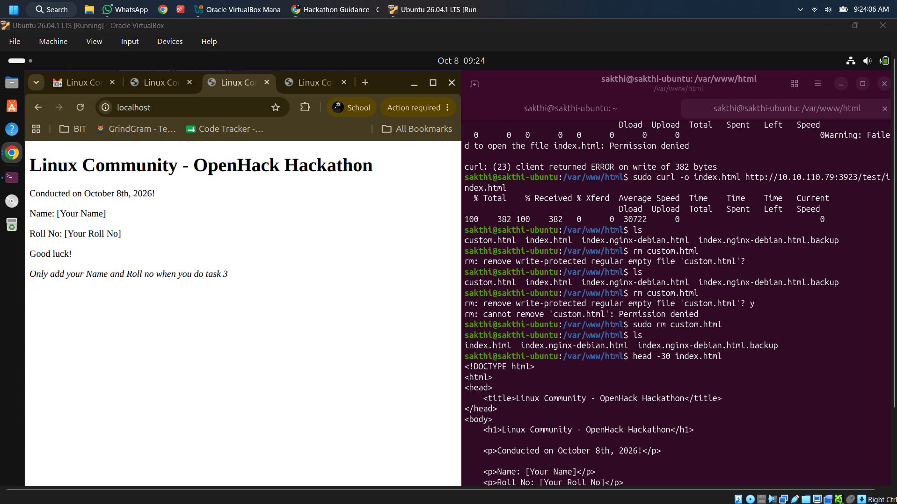
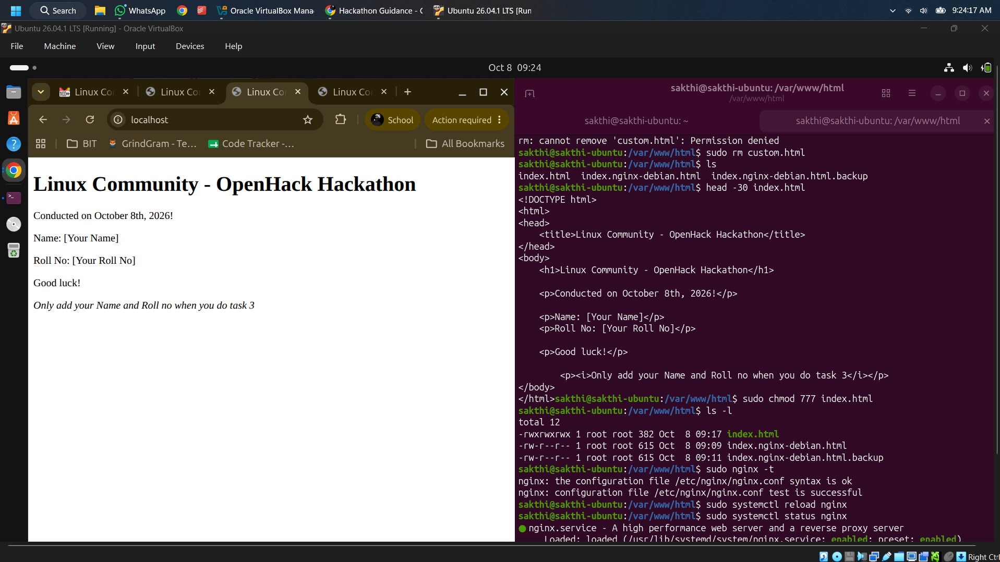
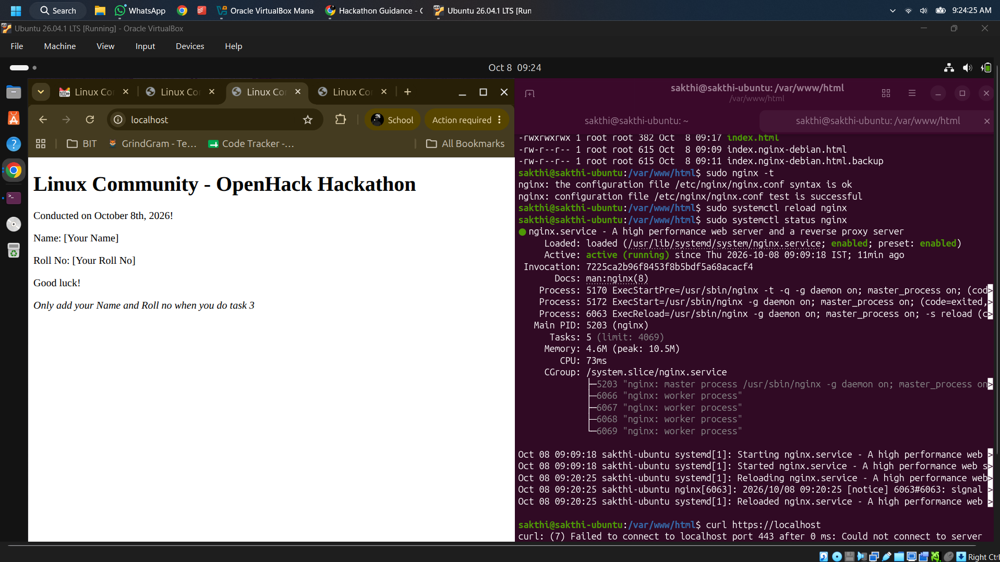
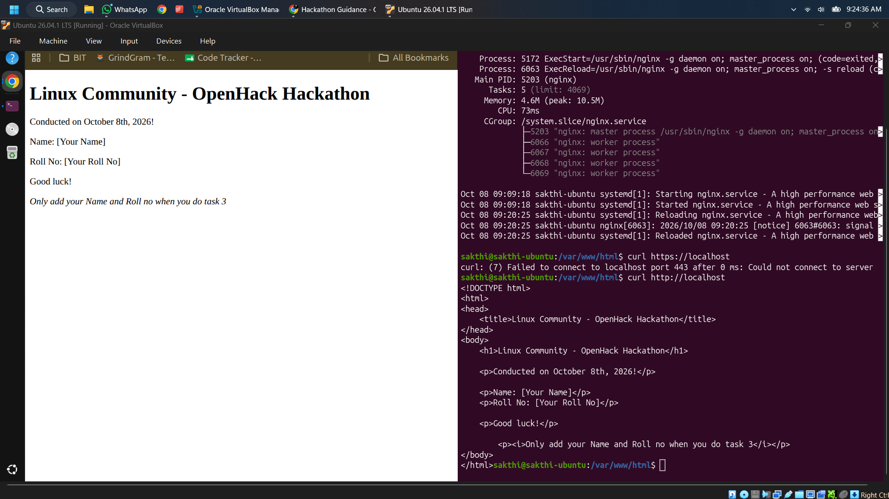

# Task 1: Set Up an Nginx Server to Serve Custom HTML Page

## Objective
Set up an Nginx web server on a Linux machine to host and serve a custom HTML page provided by the hackathon organizers, ensuring full functionality via terminal commands and browser verification.

---

## Prerequisites & Requirements
- **Operating System:** Ubuntu Linux (Ubuntu 26.04.1 LTS / Oracle VirtualBox)
- **Web Server:** Nginx
- **Tools Used:** Terminal (`apt`, `systemctl`, `curl`, `chmod`, `ls`, `rm`)

---

## Step-by-Step Execution & Terminal Commands

### Step 1: Preview Provided Custom HTML Page
The hackathon organizers provided an initial custom HTML page template for hosting.



*Figure 1.1: Custom HTML page template provided by organizers.*

---

### Step 2: Install Nginx Web Server
Install Nginx using the `apt` package manager:

```bash
sudo apt update
sudo apt install nginx -y
```



*Figure 1.2: Terminal execution of `sudo apt install nginx -y`.*

---

### Step 3: Verify Nginx Service Status & Initial HTTP Response
Verify that the Nginx service is installed, active, enabled on boot, and responding to HTTP requests on `localhost`.

```bash
# Check installed Nginx version
nginx -v

# Check Nginx service status
sudo systemctl status nginx

# Verify Nginx is enabled on startup
sudo systemctl is-enabled nginx

# Test local HTTP response header
curl -I http://localhost
```

**Output Verification:**
- Nginx version: `nginx/1.28.3 (Ubuntu)`
- Service Status: `active (running)`
- HTTP Header: `HTTP/1.1 200 OK`



*Figure 1.3: Verification of Nginx version, service status, and `curl` HTTP header response.*

---

### Step 4: Backup Default Web Root Directory
Navigate to `/var/www/html/` and create a backup of the default Nginx landing page.

```bash
# List web root directory contents
ls -la /var/www/html/

# Create backup of default debian index page
sudo cp /var/www/html/index.nginx-debian.html /var/www/html/index.nginx-debian.html.backup

# Navigate to web root
cd /var/www/html/
```



*Figure 1.4: Inspecting web directory and backing up `index.nginx-debian.html`.*

---

### Step 5: Download & Host Organizer's Custom HTML Page
Download the custom HTML file directly into `/var/www/html/index.html` from the organizer's provided URL using `curl`.

```bash
sudo curl -o index.html http://10.10.110.79:3923/test/index.html
```



*Figure 1.5: Fetching custom HTML file from organizer link to `/var/www/html/index.html`.*

---

### Step 6: Verify HTML Structure and File Cleanliness
Remove unused test files and inspect the downloaded HTML file using `head`.

```bash
# Remove temporary file if exists
sudo rm custom.html

# View contents of index.html
head -30 index.html
```

**Content View:**
```html
<!DOCTYPE html>
<html>
<head>
    <title>Linux Community - OpenHack Hackathon</title>
</head>
<body>
    <h1>Linux Community - OpenHack Hackathon</h1>
    <p>Conducted on October 8th, 2026!</p>
    <p>Name: [Your Name]</p>
    <p>Roll No: [Your Roll No]</p>
    <p>Good luck!</p>
    <p><i>Only add your Name and Roll no when you do task 3</i></p>
</body>
</html>
```



*Figure 1.6: Cleaning web directory and confirming custom `index.html` code.*

---

### Step 7: Set File Permissions, Test Configuration & Reload Nginx
Set appropriate permissions on `index.html`, test Nginx configuration syntax, and reload the Nginx daemon.

```bash
# Set permissions
sudo chmod 777 index.html

# Verify Nginx configuration syntax
sudo nginx -t

# Reload Nginx service
sudo systemctl reload nginx

# Check status after reload
sudo systemctl status nginx
```



*Figure 1.7: Permissions configuration, `sudo nginx -t` check, and reloading Nginx.*

---

### Step 8: HTTPS Connection Pre-Check
Verified HTTPS endpoint status before certificate setup (confirms port 443 is closed until Task 5 configuration).

```bash
curl https://localhost
```



*Figure 1.8: Verifying port 443 response behavior prior to HTTPS migration.*

---

### Step 9: Final Terminal Verification & Web Browser Test
Confirm that Nginx serves the full HTML file locally via `curl` and through the browser interface at `http://localhost`.

```bash
curl http://localhost
```



*Figure 1.9: Successful `curl http://localhost` returning full hosted custom HTML page.*

---

## Conclusion
Task 1 has been successfully completed entirely via the Linux terminal. The Nginx server is actively running, fully configured, and serving the organizer's custom HTML page at `http://localhost`.
