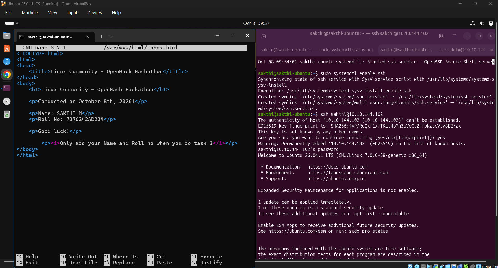
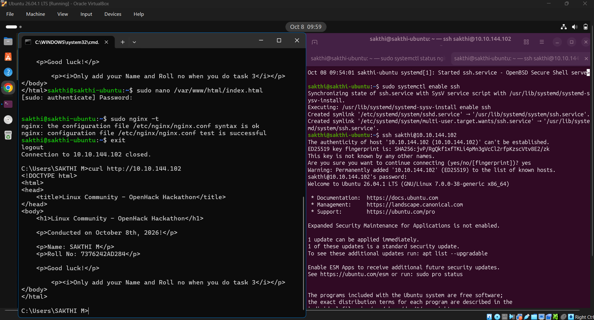
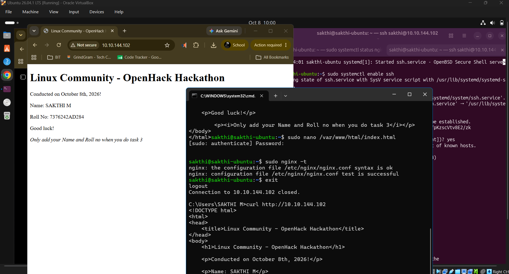

# Task 3: Modify Hosted Custom HTML Page from Another Computer

## Objective
From another computer on the same network, securely connect to the hosting server, modify the custom HTML page to include student details (Name and Roll Number), and verify that the changes are instantly reflected on the live web server.

---

## Step-by-Step Implementation & Verification

### Step 1: Enable SSH Service on the Linux Host
On the Linux web server, ensure the OpenSSH server daemon is active and enabled to accept remote terminal sessions.

```bash
# Install and enable SSH service
sudo apt install openssh-server -y
sudo systemctl enable ssh
```

---

### Step 2: Remote Connection & HTML Modification
From the remote computer (Client Terminal / Windows CMD), establish an SSH connection to the Linux server (`10.10.144.102`) and edit `/var/www/html/index.html` using `nano`.

```bash
# Connect to Linux host from remote machine
ssh sakthi@10.10.144.102

# Edit index.html with elevated privileges
sudo nano /var/www/html/index.html
```

**Modifications Added:**
```html
<p>Name: SAKTHI M</p>
<p>Roll No: 7376242AD284</p>
```



*Figure 3.1: Editing `/var/www/html/index.html` over SSH connection from remote terminal.*

---

### Step 3: Test Nginx Configuration & Exit SSH
Verify Nginx syntax, ensure no syntax errors exist, and exit the SSH remote session.

```bash
sudo nginx -t
exit
```



*Figure 3.2: Configuration test and remote terminal `curl http://10.10.144.102` output.*

---

### Step 4: Verify Remote Reflection in Browser & Terminal
From the remote client computer, query the updated page via `curl` and open `http://10.10.144.102` in a browser.

```cmd
curl http://10.10.144.102
```

**Rendered HTML Content:**
```html
<!DOCTYPE html>
<html>
<head>
    <title>Linux Community - OpenHack Hackathon</title>
</head>
<body>
    <h1>Linux Community - OpenHack Hackathon</h1>
    <p>Conducted on October 8th, 2026!</p>
    <p>Name: SAKTHI M</p>
    <p>Roll No: 7376242AD284</p>
    <p>Good luck!</p>
    <p><i>Only add your Name and Roll no when you do task 3</i></p>
</body>
</html>
```



*Figure 3.3: Verification of live webpage updates in browser and remote terminal.*

---

## Conclusion
Task 3 has been completed successfully. The hosted HTML page was edited remotely over SSH from a separate computer, and the updated Name and Roll Number details were verified live across the network.
