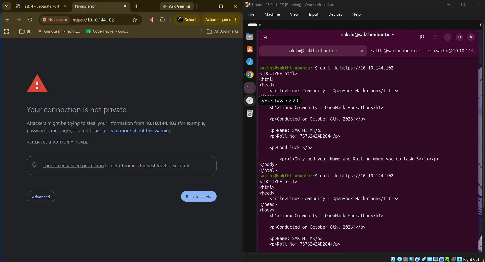

# Task 5: Convert Hosted Page into HTTPS Page & Verify Secure Access

## Objective
Convert the primary web server hosting the custom HTML page on port `80` to serve securely over HTTPS on port `443` using SSL/TLS encryption, verifying secure access via `curl` and browser certificate inspection.

---

## Step-by-Step Implementation & Verification

### Step 1: Generate SSL/TLS Certificate & Private Key
Generate a self-signed SSL certificate and key pair using `openssl` for local secure HTTPS hosting.

```bash
# Generate self-signed RSA 2048-bit SSL certificate
sudo openssl req -x509 -nodes -days 365 -newkey rsa:2048 \
  -keyout /etc/ssl/private/nginx-selfsigned.key \
  -out /etc/ssl/certs/nginx-selfsigned.crt
```

---

### Step 2: Configure Nginx for HTTPS (Port 443)
Update the default Nginx site configuration (`/etc/nginx/sites-available/default`) to enable SSL listening on port `443` and specify the SSL certificate and private key paths.

```nginx
server {
    listen 80 default_server;
    listen [::]:80 default_server;

    listen 443 ssl default_server;
    listen [::]:443 ssl default_server;

    ssl_certificate /etc/ssl/certs/nginx-selfsigned.crt;
    ssl_certificate_key /etc/ssl/private/nginx-selfsigned.key;

    root /var/www/html;
    index index.html;

    server_name _;

    location / {
        try_files $uri $uri/ =404;
    }
}
```

---

### Step 3: Test Syntax & Reload Nginx
Validate configuration syntax using `nginx -t` and reload the Nginx daemon.

```bash
# Test Nginx syntax
sudo nginx -t

# Reload Nginx service
sudo systemctl reload nginx
```

---

### Step 4: Verify Secure HTTPS Access via Terminal & Browser
Verify that Nginx securely serves content over `https://10.10.144.102`.

```bash
# Test HTTPS response via curl (bypassing self-signed CA warning)
curl -k https://10.10.144.102
```

**Terminal Verification Output:**
```html
<!DOCTYPE html>
<html>
<head>
    <title>Linux Community - OpenHack Hackathon</title>
</head>
<body>
    <h1>Linux Community - OpenHack Hackathon</h1>
    <p>Conducted on October 8th, 2026!</p>
    <p>Name: SAKTHI M</p>
    <p>Roll No: 7376242AD284</p>
    <p>Good luck!</p>
    <p><i>Only add your Name and Roll no when you do task 3</i></p>
</body>
</html>
```



*Figure 5.1: Terminal `curl -k https://10.10.144.102` execution and HTTPS SSL connection warning in Chrome.*

---

## Conclusion
Task 5 has been successfully completed. The primary hosted webpage has been migrated to HTTPS on port `443` with SSL/TLS encryption, satisfying all 5 hackathon task requirements.
